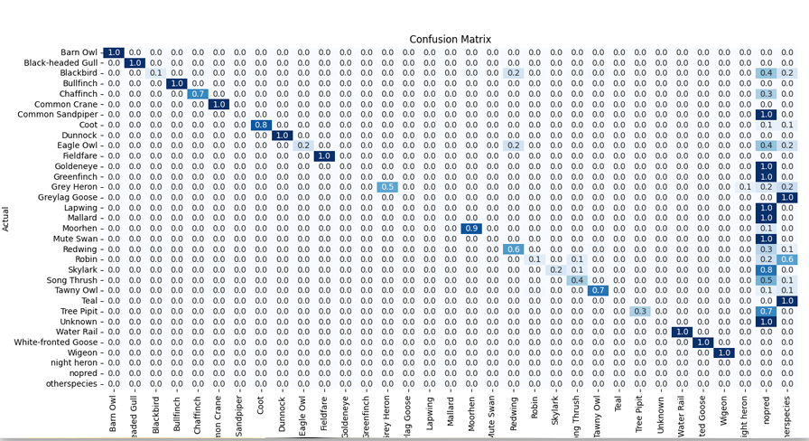
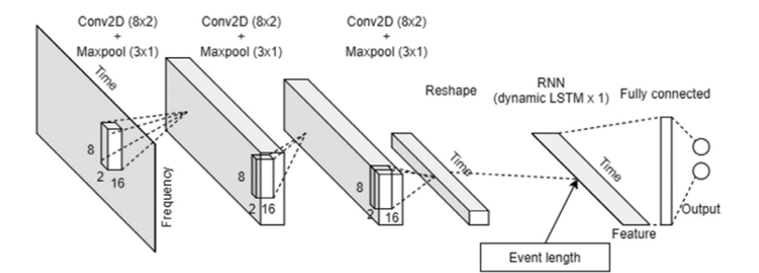
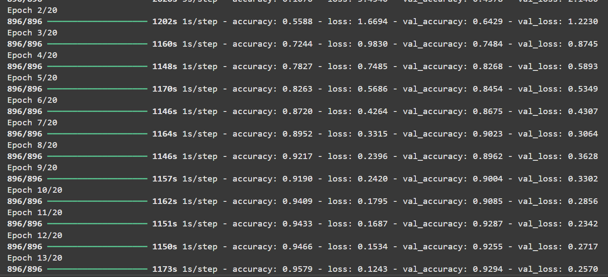
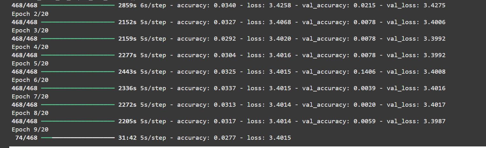
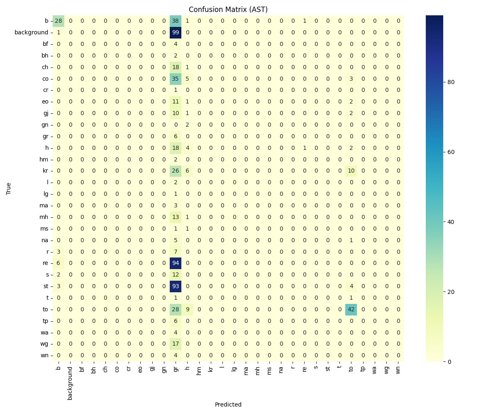
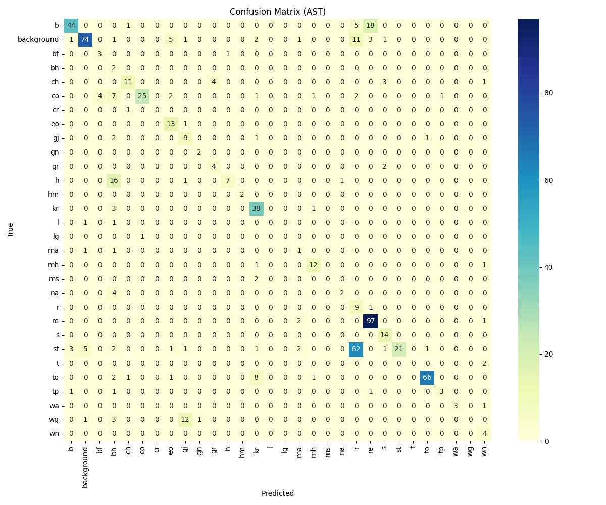
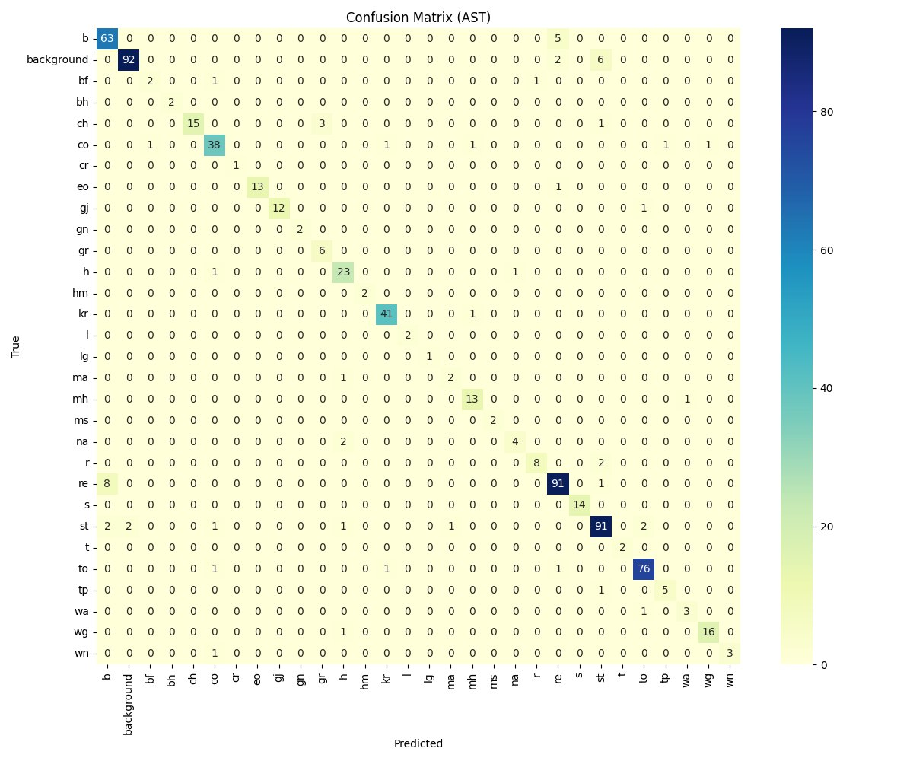

### Summary of results
1. Explored a variety of audio classification models, including both pretrained and custom-made architectures.
2. Tested models: BirdNet, YAMNet, ResNet, CNN-LSTM layers, and AST-P (Audio Spectrogram Transformer - P variant).
3. Preprocessing and model scripts are organized into respective folders with brief usage guides.
4. Summary of experimental findings is detailed below ⬇️

### BirdNet usage
 🔻birdnet used  with oversampling, lots of classes misclassified, general results - could detect few bird species
 
> oversampling , final dataset apx 19000 (means that most likely it has same samples in train and test datasets)

### YamNet, ResNet usage
performed similarly to BirdNet.
YAMNet is a pretrained model on AudioSet, designed for general-purpose sound classification. While it effectively detects broad sound categories, it struggles with the fine-grained task of distinguishing between similar bird species.
ResNet, applied to spectrograms, also showed limited success — likely because it lacks audio-specific pretraining and was not optimized for species-level sound differences. These models may require extensive fine-tuning and more diverse data to perform well on bioacoustic tasks.

### CNN-LSTM layers
- tested custom CNN-LSTM architectures on Constant-Q and Mel spectrograms.
- used oversampling and class weighting as techniques for imbalance mitigation.

according to some reaserches this model was efficient on similar tasks with short term noises 
 

> Observations:

- CNN-LSTM worked well in literature for short, noisy signals, but here results were underwhelming.
- GPU memory limitations (16GB) constrained input sizes, reducing performance for:
  128×128, 256×256, or 84×84 input sizes.
- required small batch sizes, which made training unstable or slow.

Oversampling helped but often led to overfitting.
Without it, models failed to learn well.
with less or without oversampling -> failed to produce good results

vs

### AST-P (final and best try)

1. AST-P was pretrained on audio spectrograms, making it highly suitable for this task.
2. used no oversampling; instead, used class weighting and stratified splitting to preserve class distributions.

#### How it works
- input: log-Mel spectrograms
- 1024-patch inputs (corresponds to 10s audio)

#### Dataset breakthrough
3525 samples after all preprocessing steps
precomputed ast-p tensors are saved in precomputed_ast folder (for saving some computational powers during training because we also would like to train it several times, so it will save some time)
 __ class BirdSoundDataset(Dataset) <- subclassing pytorch dataset for implementation of two methods: 
__getitem__ -> to load sample  and __len__ for retrieving dataset length which is needed for batching

#### Loading data

- loaded metadata from CSV (generated from tensor filenames)
- computed class weights from class distribution
- Used train_test_split(..., stratify=labels) to ensure balanced splitting

### Training 

- trained for 10, 20, and 30 epochs
- optimizer: Adam (SGD tested but underperformed significantly)
- compared performance using classification reports

results on 1st epoch
_(here to prove that model is actually improving, because if severe oversampling -> model shows way too good results)_ : 

for 10 epochs

for 20 epochs

for 30 epochs

#### Meaning 
| Label | Epoch 10 F1 | Epoch 20 F1 | Epoch 30 F1 | Notes                          |
| ----- | ----------- | ----------- | ---- |--------------------------------|
| `bf`  | 0.57        | 1.00        | 1.00 | Perfected                      |
| `gr`  | 1.00        | 0.71        | 0.86 | Recovering                     |
| `ms`  | 1.00        | 1.00        | 0.00 | (very low support on 30 epoch) |
| `lg`  | 1.00        | 0.00        | 1.00 | Perfect recovery               |
| `wa`  | 0.94        | 0.86        | 1.00 | Improved again                 |

### And overall metrics results

| Metric                    | Epoch 10 | Epoch 20    | Epoch 30     |
| ------------------------- | -------- | ----------- | ------------ |
| **Accuracy**              | 0.9149   | 0.9234      | **0.9305** ✅ |
| **Macro Avg (F1)**        | 0.90     | **0.88** 🔻 | **0.90** 🔼  |
| **Weighted Avg (F1)**     | 0.91     | 0.92        | **0.93** ✅   |
| **Macro Avg (Recall)**    | 0.90     | **0.89** 🔻 | **0.90** 🔼  |
| **Weighted Avg (Recall)** | 0.91     | 0.92        | **0.93** ✅   |

### Conclusions:
1. AST-P is the best-performing model, especially when combined with proper preprocessing and stratified data handling.
2. The model generalizes well without oversampling, leveraging class weighting and stratified splits to balance performance across classes.
3. Other architectures (BirdNet, CNN-LSTM) underperformed likely due to:
   - insufficient data diversity 
   - hardware constraints
   - limitations of general-purpose audio features

**straight up facts**
- pretrained domain-specific architectures like AST are more computationally efficient and performance effective than starting from scratch.
- don’t reinvent the wheel, reuse well-trained backbones when possible — the time saved on training is significant.

>  most used literature

 
1. Hershey, S., Chaudhuri, S., Ellis, D. P. W., Gemmeke, J. F., Jansen, A., Moore, R. C., … Saurous, R. A. (2017). **CNN Architectures for Large-Scale Audio Classification. In ICASSP.**
   [arXiv:1609.09430](https://arxiv.org/abs/1609.09430)
2. Kong, Q., Cao, Y., Iqbal, T., Wang, Y., Wang, W., & Plumbley, M. D. (2020). **PANNs: Large-Scale Pretrained Audio Neural Networks for Audio Pattern Recognition.**
   [arXiv:1912.10211](https://arxiv.org/abs/1912.10211)
3. J. Xie, X. Aubert, X. Long, J. van Dijk, B. Arsenali, P. Fonseca, and S. Overeem, **Audio-based snore detection using deep neural networks, Computer Methods and Programs in Biomedicine**, vol. 200, p. 105913, 2021. [available here](https://doi.org/10.1016/j.cmpb.2020.105913)
   [and review](https://sh-tsang.medium.com/brief-review-audio-based-snore-detection-using-deep-neural-networks-c2f240d02d0f)
4. Y. Gong, Y.-A. Chung and J. Glass, **AST: Audio Spectrogram Transformer** (2021). [arXiv:2104.01778](https://arxiv.org/abs/2104.01778)
  and author`s GitHub [here](https://github.com/YuanGongND/ast?tab=readme-ov-file)

