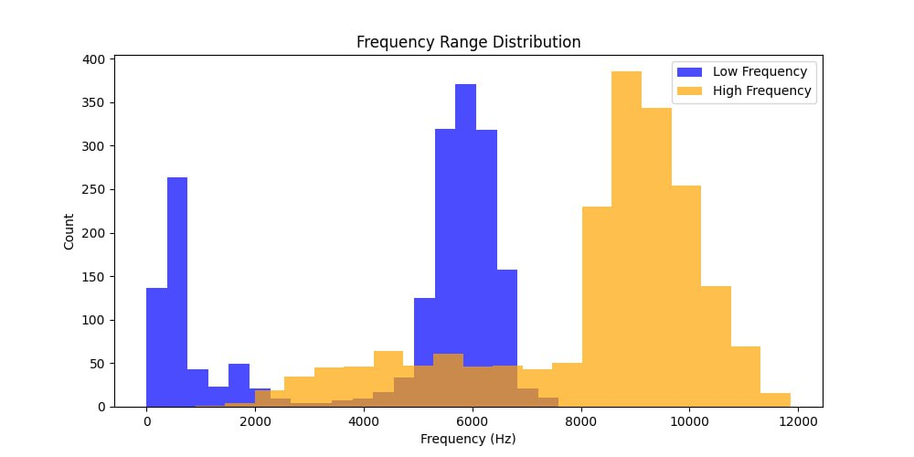
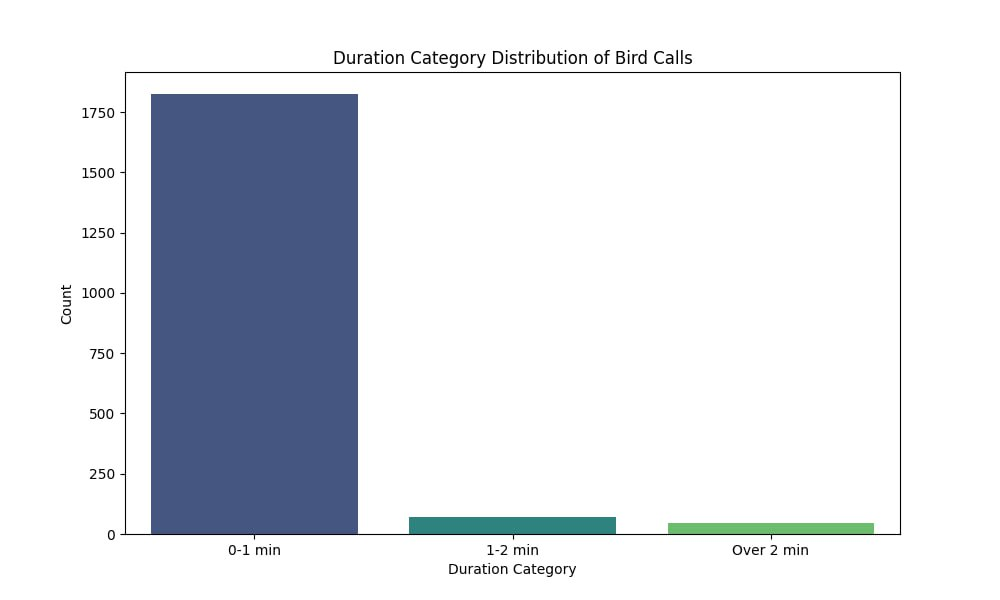
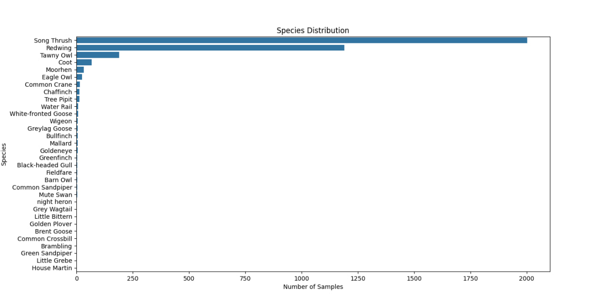
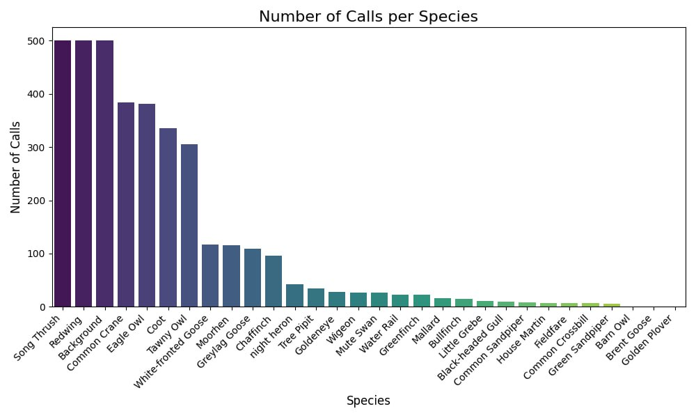
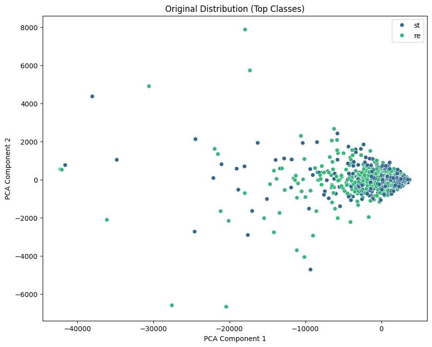
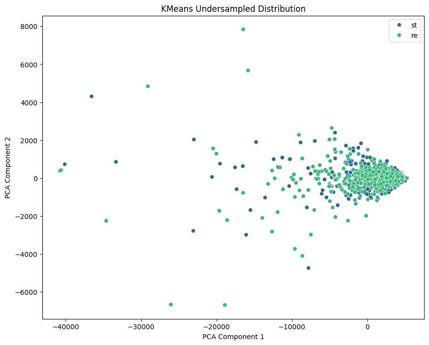
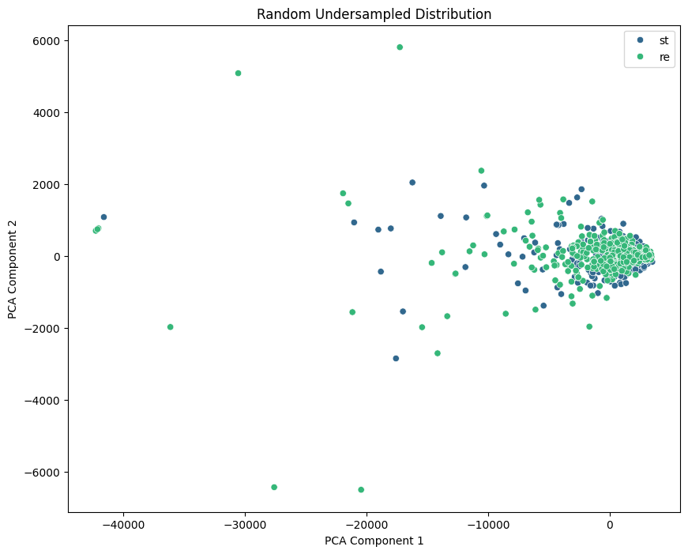

#### preprocessing scripts were used for creating clear dataset

### PREPROCESSING STEPS:
> oversampling
1. SMOTE tends to generate noisy data which rather makes classes less distinctive - could not be applied here for
2. Sliding window - splitting original audiofiles based on their duration
   automatical script was used for splitting long calls which had 1+ min of duration, longer calls were splitted even more times
   dataset
3. a bit of manual preprocessing for files after auto splitting for rare classes,
as some files could have more occurrences of bird calls but to avoid creating noisy data those files had to be manually splitted

>undersampling
1. taking short calls under 1s for most species and concatenating them to make calls at least 5sec long
2. deleting redundant datafiles with k-means algorithm
3. resulting file - undersampled_kmeans.csv / data folder : clear

>data analysis
1. creating csv file from filenames
2. analysed dataset from csv by frequencies, species occurrences, and audio duration

before: 

after: 

#### Extra: 
comparison of undersamplind random vs k-means (not very much different results 
but there`s outliers which were preserved with k-means usage)

